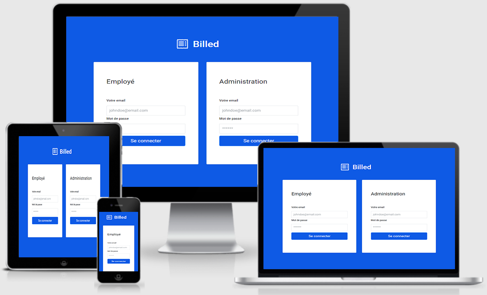

# Projet n°11 : Débugger et tester un SaaS RH (partie front-end)


[](https://www.linkedin.com/in/timote-lancelle-devweb/)

## :mag: Aperçu



## :bookmark_tabs: Sommaire
<ol>
    <li><a href="#sujet">Sujet</a></li>
    <li><a href="#demandes_respecter">Demandes à respecter</a></li>
    <li><a href="#objectifs_projet">Objectifs du projet</a></li>
    <li><a href="#technologies_utilisees">Technologies utilisées</a></li>
    <li><a href="#prerequis">Prérequis</a></li>
    <li><a href="#installation">Installation</a></li>
    <li><a href="#utilisation_siteweb">Utilisation du site web</a></li>
    <li><a href="#auteurs_contributeurs">Auteurs et contributeurs</a></li>
    <li><a href="#licence">Licence</a></li>
</ol>

## :page_facing_up: 1. Sujet <a name = "sujet"></a>

Vous êtes développeur front-end chez Billed, une entreprise qui produit des solutions Saas destinées aux équipes de ressources humaines.

Malheureusement pour Billed, Garance, une collègue de la feature team “note de frais” a quitté l’entreprise avant d’avoir terminé l’application.

Dans deux semaines, l’équipe doit montrer la solution qui fonctionne à l’ensemble de l’entreprise.

Matthieu, Lead Developer de la feature team a demandé à être aidé pour tenir les délais et vous avez appris hier lors de la réunion d’équipe que c’est vous qui avez été désigné !

## :memo: 2. Demandes à respecter <a name = "demandes_respecter"></a>

* Tester le front-end du parcours employé en utilisant le Chrome Debugger (Chrome DevTools) ;
* Fixer les bugs identifiés dans le rapport de bug fourni par Jest, et suite aux tests effectués, du parcours employé et admin, en utilisant le Chrome Debugger (Chrome DevTools) ;
* Ajouter des tests unitaires et d’intégration (il faut assurer un taux de couverture global des containers de 80% minimum (tests unitaires et tests d’intégration)) ;
* Rédiger un plan de test End-to-End (E2E) sur le parcours employé.

## :checkered_flag: 3. Objectifs du projet <a name = "objectifs_projet"></a>

* Apprendre à utiliser le Chrome DevTools ;
* Apprendre à interpréter et résoudre des bugs ;
* Apprendre à utiliser Jest ;
* Apprendre à écrire des tests unitaires et d’intégration ;

## :computer: 4. Technologies utilisées <a name = "technologies_utilisees"></a>

* HTML
* CSS
* JavaScript / JQuery
* Jest
* Git & GitHub

## :exclamation: 5. Prérequis <a name = "prerequis"></a>

* Avoir fait le necéssaire avec la partie back-end disponible ici : https://github.com/LancelleTimote/Projet-n-11-Debugger-et-tester-un-SaaS-RH-partie-back-end

## :wrench: 6. Installation <a name = "installation"></a>

* Cloner ce repository.
* Pour installer les différents packages, dans le terminal à partir du dossier front-end, exécuter npm install.
* Installez live-server pour lancer un serveur local, exécuter npm install -g live-server

## :question: 7. Utilisation du site web <a name = "utilisation_siteweb"></a>

* Dans le terminal à partir du dossier back-end, exécuter npm run run:dev
* Dans le terminal à partir du dossier front-end, exécuter live-server
* L'api est disponible sur : http://localhost:5678
* La couverture de test est disponible sur : http://127.0.0.1:8080/coverage/lcov-report/
* Pour lancer un test seul, installez jest-cli en exécutant npm i -g jest-cli, puis dans le terminal à partir du dossier front-end lancez la commande jest src/__tests__/your_test_file.js
* Pour lancer tous les tests en local avec Jest, dans le terminal à partir du dossier front-end, exécutez npm run test.
* Le site est disponible sur le navigateur en allant sur : http://127.0.0.1:8080/
* Vous pouvez vous connecter en utilisant les comptes :

Administrateur :
```
utilisateur : admin@test.tld
mot de passe : admin
```
Employé :
```
utilisateur : employee@test.tld
mot de passe : employee
```

## :beers: 8. Auteurs et Contributeurs <a name = "auteurs_contributeurs"></a>

Timoté Lancelle : [GitHub](https://github.com/LancelleTimote) / [LinkedIn](https://www.linkedin.com/in/timote-lancelle-devweb/)

## :page_with_curl: 9. Licence <a name = "licence"></a>

Distribué sous la licence MIT. Voir le fichier [LICENSE](LICENSE) pour plus d'informations.